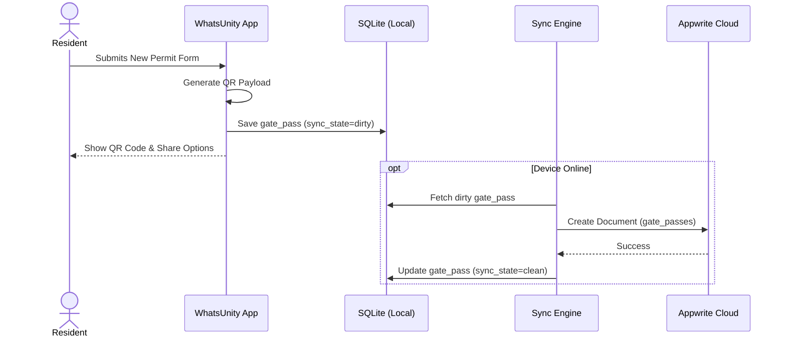
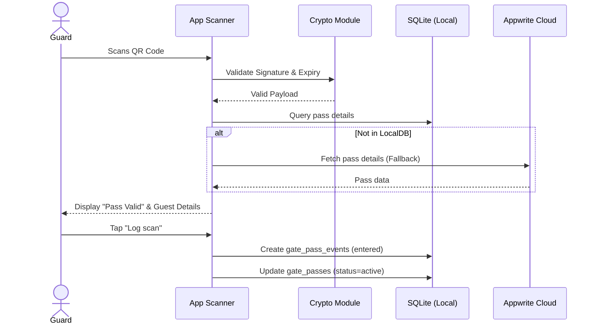
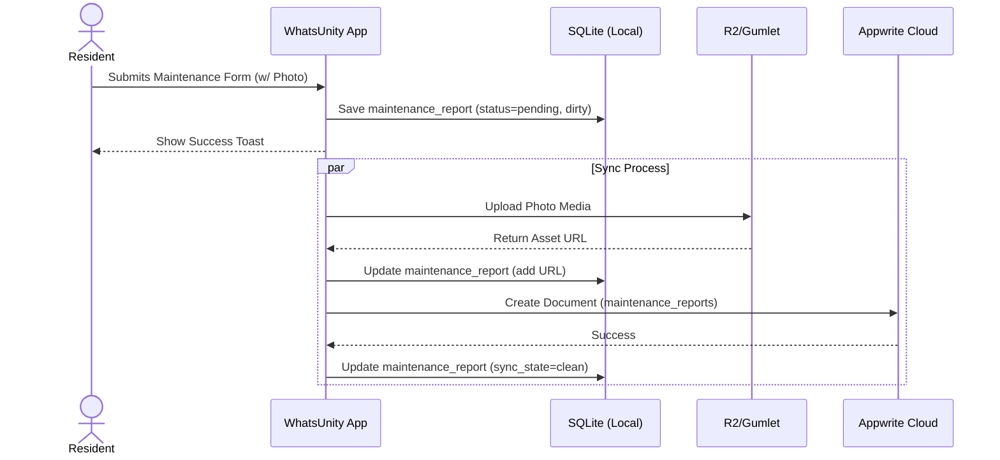
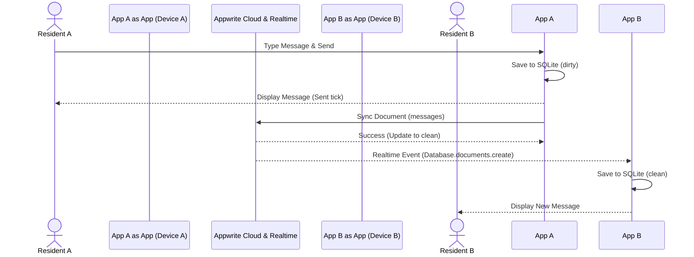

# WhatsUnity Agile Project Documentation

This document provides a comprehensive overview of the WhatsUnity application based on industry Agile and Architecture standards.

## 1. Technical Architecture

### 1.1 Tech Stack
*   **Frontend**: Flutter (Dart) - Chosen for its cross-platform capabilities (iOS, Android, Web) and rich UI ecosystem.
*   **Backend as a Service (BaaS)**: Appwrite - Handles Authentication, Databases, Storage, and Realtime capabilities.
*   **Local Database**: SQLite (via Drift) - Enables offline-first functionality and local caching.
*   **State Management**: BLoC / Cubit - Enforces a predictable, unidirectional data flow.
*   **Storage**: Cloudflare R2 (Static Assets), Gumlet (Video/Audio HLS Streaming).
*   **Push Notifications**: Firebase Cloud Messaging (FCM).

### 1.2 System Context
WhatsUnity is a residential community management platform bridging the gap between Residents, Gate Security, Community Management, and Service Providers. The system ensures that operations continue seamlessly even during internet outages, synchronizing with the central Appwrite cloud whenever connectivity is restored.

### 1.3 Container Architecture (Frontend/Backend)
*   **Frontend Container**: 
    *   **Presentation Layer**: UI Widgets, Pages, Theme, and L10n.
    *   **Business Logic Layer**: Blocs and Cubits orchestrating user intents.
    *   **Domain Layer**: Repositories abstracting data origin (Remote vs. Local).
    *   **Data Layer**: Local Data Source (SQLite) and Remote Data Source (Appwrite APIs).
    *   **Sync Engine Worker**: Background process handling bidirectional synchronization between SQLite and Appwrite.
*   **Backend Container (Appwrite)**:
    *   **Auth Service**: Custom session handling linked to compound environments.
    *   **Database Service**: Flat schema collections organized across multiple databases (`auth`, `social`, `admin`, `maintenance`, `security`, `services`).
    *   **Realtime WebSocket**: Pushes data invalidations and new events to connected clients.
    *   **Functions**: Serverless functions handling sensitive operations.

### 1.4 Database Strategy
The application employs an **Offline-First Synchronization** strategy. 
*   **Local-First Reads/Writes**: All user actions write immediately to the local SQLite database. Data is read instantly from the local cache.
*   **Conflict Resolution**: Last-Write-Wins (LWW) resolution is utilized.
*   **Relational Mapping**: To maintain offline simplicity, complex SQL joins are minimized. Collections rely on flat `String` IDs.

### 1.5 Data Security
*   **Authentication**: OAuth2 and Email/Password flows secured via Appwrite.
*   **Role-Based Access Control (RBAC)**: Appwrite Document Level Security (DLS) restricts data access based on user roles.
*   **Local Encryption**: The SQLite database utilizes SQLCipher (via `encrypted_drift`) to encrypt data at rest on the device.

---

## 2. Features Documentation

### 2.1 Core Modules

#### 1. Authentication & Provisioning
*   **Description**: Handles user sign-up, sign-in, OAuth integration, and dynamic routing to compound-specific projects based on verified roles.
*   **Business Value**: Ensures secure, verified access to community spaces and prevents unauthorized data exposure.
*   **Priority**: Critical (P0)

#### 2. Gate Security (Security Portal)
*   **Description**: Enables guards to log visitors, verify QR passes generated by residents, and track active visitor durations.
*   **Business Value**: Modernizes physical compound security, providing a digital paper trail for entries and exits, thereby increasing resident safety.
*   **Priority**: Critical (P0)

#### 3. Maintenance Tracking
*   **Description**: Allows residents to report issues with photos; routes requests to managers/technicians for status tracking and resolution.
*   **Business Value**: Improves SLA response times for compound upkeep and increases resident satisfaction.
*   **Priority**: High (P1)

#### 4. Social Feed & Community Chat
*   **Description**: A localized social network for the compound including generalized posts, community votes, and dedicated channel-based chats (Building, General).
*   **Business Value**: Fosters a strong sense of community, increasing platform stickiness and user retention.
*   **Priority**: High (P1)

#### 5. Finance & Billing
*   **Description**: Tracks building budgets, recurring plans, cash flow, and unpaid invoices for community or building-specific collections.
*   **Business Value**: Provides transparency in community fund management and automates the collection process.
*   **Priority**: Medium (P2)

#### 6. Directory
*   **Description**: A centralized phonebook for emergency contacts, neighbors, and community staff.
*   **Business Value**: Ensures residents have immediate access to critical compound contacts.
*   **Priority**: Medium (P2)

#### 7. Admin & Moderation Panel
*   **Description**: Dashboard for compound managers to approve/reject resident applications, moderate chat, and oversee aggregate compound statistics.
*   **Business Value**: Gives management total control over the digital ecosystem of their compound.
*   **Priority**: Critical (P0)

#### 8. Service Provider Marketplace
*   **Description**: Allows verified external service providers (plumbers, electricians, brokers) to offer their services to residents.
*   **Business Value**: Creates an ecosystem for trusted vendors and potential monetization through service lead fees.
*   **Priority**: Low (P3)

---

## 3. Use Cases & Sequence Diagrams

### 3.1 Visitor Gate Pass Generation
*   **Actor**: Resident
*   **Trigger**: Resident expects a guest or delivery and wants to pre-authorize their entry.
*   **Pre-conditions**: Resident is logged in and profile is verified.
*   **Main Success Scenario**:
    1. Resident navigates to the Security Portal.
    2. Resident clicks "New Permit" and inputs guest details (Name, Purpose, Valid Until).
    3. Resident submits the form.
    4. System generates a secure QR code payload.
    5. Resident shares the QR code with the guest via WhatsApp/System share dialog.
*   **Alternate Flows**: *System is offline*: The pass is saved locally with a pending sync state. User is warned that the pass will not be verifiable at the gate until the device is online.
*   **Post-conditions**: A `gate_passes` document is created.

### 3.2 Verify Visitor at Gate
*   **Actor**: Gatekeeper (Security Guard)
*   **Trigger**: A guest arrives at the gate and presents a QR pass.
*   **Pre-conditions**: Gatekeeper is logged into the Security Dashboard.
*   **Main Success Scenario**:
    1. Gatekeeper selects "Scan QR Code".
    2. Gatekeeper scans the guest's presented QR code.
    3. System validates the payload signature.
    4. System displays "Pass Valid" and shows guest details.
    5. Gatekeeper taps "Log scan".
    6. System records an `entered` event.
*   **Alternate Flows**: *QR is invalid or expired*: System highlights the pass as "Revoked" or "Expired". Guard denies entry.
*   **Post-conditions**: `gate_pass_events` log is appended. `gate_passes` status is updated.

### 3.3 Submit Maintenance Report
*   **Actor**: Resident
*   **Trigger**: Resident notices a broken facility.
*   **Pre-conditions**: Resident is logged in.
*   **Main Success Scenario**:
    1. Resident navigates to the Maintenance tab.
    2. Resident selects a Category, Title, and Description.
    3. Resident attaches photos of the issue.
    4. Resident taps "Submit Report".
    5. System saves the report locally.
    6. System queues media for upload to Gumlet/R2.
    7. System sets status to `pending`.
*   **Alternate Flows**: *No connection*: Text data is saved locally. Media upload is queued. Once reconnected, media is uploaded, and Appwrite document is updated.
*   **Post-conditions**: A new document in `maintenance_reports` is created.

### 3.4 Community Chat (Offline & Realtime)
*   **Actor**: Resident
*   **Trigger**: Resident wants to send a message to the Building Channel.
*   **Pre-conditions**: Resident is logged in and has access to the building channel.
*   **Main Success Scenario**:
    1. Resident opens Building Chat.
    2. Resident types a message and hits send.
    3. Message is instantly saved to SQLite and appears in the chat bubble.
    4. Sync engine pushes the message to Appwrite.
    5. Appwrite Realtime broadcasts the message to other connected residents.
*   **Alternate Flows**: *Message fails to send*: Message bubble shows a red retry icon.
*   **Post-conditions**: Message is persisted across devices.

---

## 4. User Stories

### US-1: Visitor Gate Pass
**As a** verified Resident, 
**I want to** generate a temporary QR code pass for my expected guests, 
**So that** they can enter the compound securely without me needing to call the gate.

**Acceptance Criteria (BDD):**
*   **Given** I am on the Security Portal page,
*   **When** I create a new permit with valid details (Name, Time),
*   **Then** a QR code is generated and displayed on my screen,
*   **And** I can share this QR code directly via WhatsApp.

### US-2: Offline Chat Access
**As a** Community Member,
**I want to** view past chat messages in the General Chat even without internet,
**So that** I can reference past conversations or announcements during outages.

**Acceptance Criteria (BDD):**
*   **Given** my device has no network connectivity (Airplane Mode),
*   **When** I open the General Chat,
*   **Then** all previously synced messages are immediately visible from the local database without loading spinners.

### US-3: Maintenance Transparency
**As a** Resident,
**I want to** see the real-time status of my maintenance requests (e.g., In Process, Completed),
**So that** I know my request is being handled without needing to call the management office.

**Acceptance Criteria (BDD):**
*   **Given** I have submitted a maintenance report,
*   **When** a technician updates the status to "In Process",
*   **Then** my maintenance history view instantly reflects this new status,
*   **And** I receive a push notification alerting me of the change.

### US-4: Security Incident Logging
**As a** Patrol Supervisor,
**I want to** log a security incident with a photo and GPS location,
**So that** the management office has an immutable record of compound events.

**Acceptance Criteria (BDD):**
*   **Given** I am logged in with a Patrol Supervisor role,
*   **When** I submit an incident report with a photo,
*   **Then** the incident is saved locally and synced to the cloud,
*   **And** the incident is visible on the central management dashboard.

### US-5: Transparent Building Budgets
**As a** Resident,
**I want to** view my building's financial balance and recent cash flow,
**So that** I have transparency over how collected maintenance fees are being spent.

**Acceptance Criteria (BDD):**
*   **Given** my building has an active finance budget configured,
*   **When** I navigate to the Finance Hub,
*   **Then** I can see a summary of the current balance and the latest expense/income records.

### US-6: Admin Application Approval
**As a** Compound Manager,
**I want to** review and approve new resident registrations,
**So that** only verified homeowners or tenants gain access to the private community app.

**Acceptance Criteria (BDD):**
*   **Given** a new user has submitted proof of residency,
*   **When** I open the Pending Approvals tab,
*   **Then** I can view their uploaded documents,
*   **And** I can click "Approve" to instantly grant them resident access to the compound.

### US-7: Compound Announcements
**As a** Compound Manager,
**I want to** broadcast urgent announcements to all residents,
**So that** everyone is informed about critical events like water shutoffs or emergencies.

**Acceptance Criteria (BDD):**
*   **Given** I am authenticated as a Manager,
*   **When** I publish a High Priority announcement,
*   **Then** it appears pinned at the top of the residents' Social Feed,
*   **And** triggers a push notification to all resident devices.
