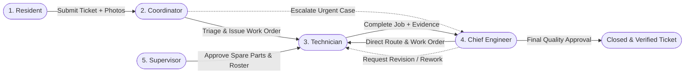
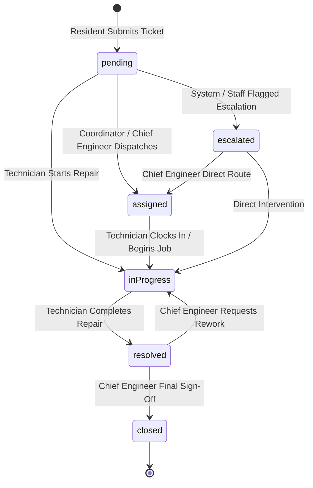
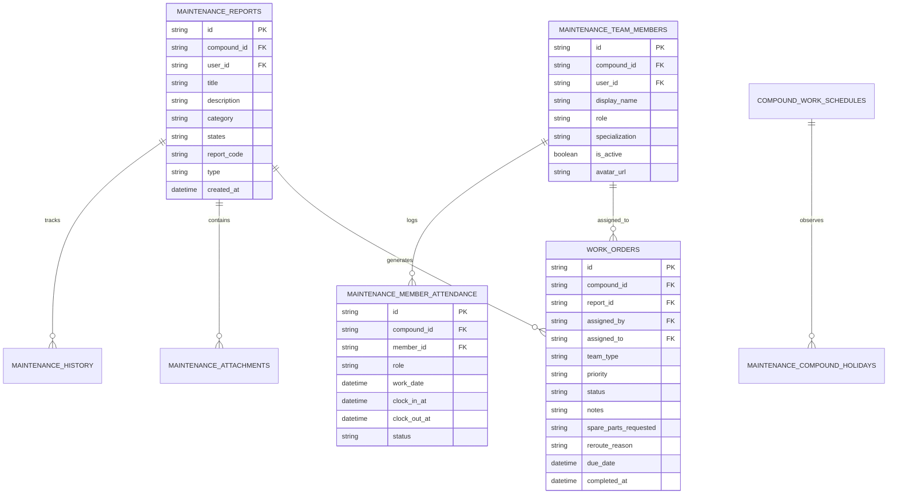

# Maintenance Lifecycle & Engineering Operations Architecture

This document provides a comprehensive technical blueprint of the **Multi-Tiered Maintenance Lifecycle**, role hierarchies, state machines, Cubits, database schema, and operational workflows within WhatsUnity.

---

## 1. Domain Overview & Multi-Tier Hierarchy

The maintenance subsystem in WhatsUnity connects 5 distinct user roles into an integrated, auditable repair workflow:



### 1.1 Maintenance Roles & Responsibilities

| Role | Domain Role Enum | Key Responsibilities |
| :--- | :--- | :--- |
| **Resident** | `resident` / `owner` / `tenant` | Submits maintenance requests with photos/audio, tracks live status (`pending`, `in_progress`, `assigned`, `resolved`, `escalated`, `closed`), views completion notes. |
| **Coordinator** | `MaintenanceTeamRole.coordinator` | Operational dispatcher: triages incoming tickets, validates categories, auto-generates compound-scoped report codes (`#MNT-XXXX`), dispatches work orders to technicians. |
| **Technician** | `MaintenanceTeamRole.technician` | Field execution: accepts work orders, tracks active repair time via live stopwatch, takes before/after repair photos, requests spare parts, logs technical completion notes. |
| **Housekeeping** | `MaintenanceTeamRole.housekeeping` | Sanitation & facility care: executes recurring routine maintenance tasks, checks off zone sanitization, uploads verification photos. |
| **Supervisor** | `MaintenanceTeamRole.supervisor` | Field supervision: monitors technician shift attendance (`maintenance_member_attendance`), reviews and approves spare parts requests, manages recurring housekeeping tasks. |
| **Chief Engineer** | `MaintenanceTeamRole.chiefEngineer` | Executive oversight: monitors single-row KPI telemetry, oversees escalated tickets, tracks live coordinator shift presence, manages technician roster workload balancing, configures weekly workdays and holiday calendars, conducts final quality sign-offs. |

---

## 2. Report & Work Order State Machines

### 2.1 Maintenance Report Lifecycle (`MaintenanceReportStatus`)



### 2.2 Work Order Status (`WorkOrderStatus`)
- `pending`: Work order issued, awaiting technician start.
- `inProgress`: Technician is on-site with active work timer running.
- `completed`: Repair finished, awaiting quality review.
- `cancelled`: Work order superseded or cancelled.

---

## 3. Database Schema & Data Models

All maintenance data is stored under the **`maintenance`** database on Appwrite and cached locally in SQLite.



---

## 4. Chief Engineer Architecture & Presentation Modules

The Chief Engineer portal is structured as a 4-tab command hub:

```
ChiefEngineerShellPage (4 Tabs)
├── 1. ChiefEngineerHomeTab
│   ├── _ChiefEngineerShiftCard (Engineer profile, shift clock-in/out, live timer)
│   ├── MaintenanceCinematicStatsGrid (Single-row KPI: Active Tickets, Escalated Alerts)
│   ├── _CoordinatorOperatorStatusCard (Live coordinator check-in check & triage fallback notice)
│   ├── Escalated Alerts Stream (Priority cards with direct Route Now action)
│   └── BroadcastPublisherPanel (Official engineering directives publisher)
│
├── 2. ChiefEngineerReportsTab
│   ├── Realtime Search Field (Report code, title, category keyword filtering)
│   ├── Status Filter Ribbon (All, Escalated, Pending, In Progress, Assigned, Resolved)
│   ├── Category Visual Ribbon (Plumbing, Electrical, HVAC, Structural, Elevators, Pest Control, etc.)
│   ├── MaintenanceReportCard Feed (Always-visible status beacon badges + action button)
│   └── _TacticalRoutingConsole (Discipline picker, candidate technician cards with workload meter, priority chips, dispatch action)
│
├── 3. ChiefEngineerTeamsTab (Unified Operations Command)
│   ├── Top Triple-Segment Selector (Approvals / Technicians / Schedules)
│   ├── Segment 1: Final Approvals Feed (ExpandableWorkOrderCard + ReviewCommentInlineForm)
│   ├── Segment 2: Technicians Directory (Specialization filter, workload indicator, trade change dropdown)
│   └── Segment 3: Schedules & Holidays (Weekly workdays selector + interactive monthly holiday calendar)
│
└── 4. ProfilePage (User settings, credentials, compound switching)
```

---

## 5. Technical Implementation & State Management (Cubits)

All maintenance features are orchestrated by pure Dart 3 Cubits resolved via `AppServices`:

```dart
// Dependency Injection Registration in core/di/app_services.dart
static void _setupMaintenanceServices() {
  maintenanceRemoteDataSource = MaintenanceRemoteDataSourceImpl(
    databases: databasesClient,
    storage: storageClient,
  );
  maintenanceLocalDataSource = MaintenanceLocalDataSourceImpl(
    sqliteDb: localDatabase,
  );
  maintenanceRepository = MaintenanceRepositoryImpl(
    remote: maintenanceRemoteDataSource,
    local: maintenanceLocalDataSource,
    syncEngine: syncEngine,
  );
}
```

### 5.1 Cubit State Machines
- **`ChiefEngineerDashboardCubit`**: Manages macro KPI telemetry, escalated reports triage, today's team attendance, and coordinator presence monitoring.
- **`ChiefEngineerReportsCubit`**: Filterable, searchable compound reports feed with direct technician routing and work order issuance.
- **`ChiefEngineerTeamCubit`**: Manages staff directory, calculates live workload per technician, and updates trade specializations.
- **`ChiefEngineerScheduleCubit`**: Configures active weekly working days and interactive monthly holiday calendar.
- **`ChiefEngineerApprovalsCubit`**: Manages completed work orders awaiting Chief Engineer quality sign-off and rework requests.
- **`MaintenanceAttendanceCubit`**: Manages daily shift clock-in/out, live elapsed timer, and on-duty badge status.
