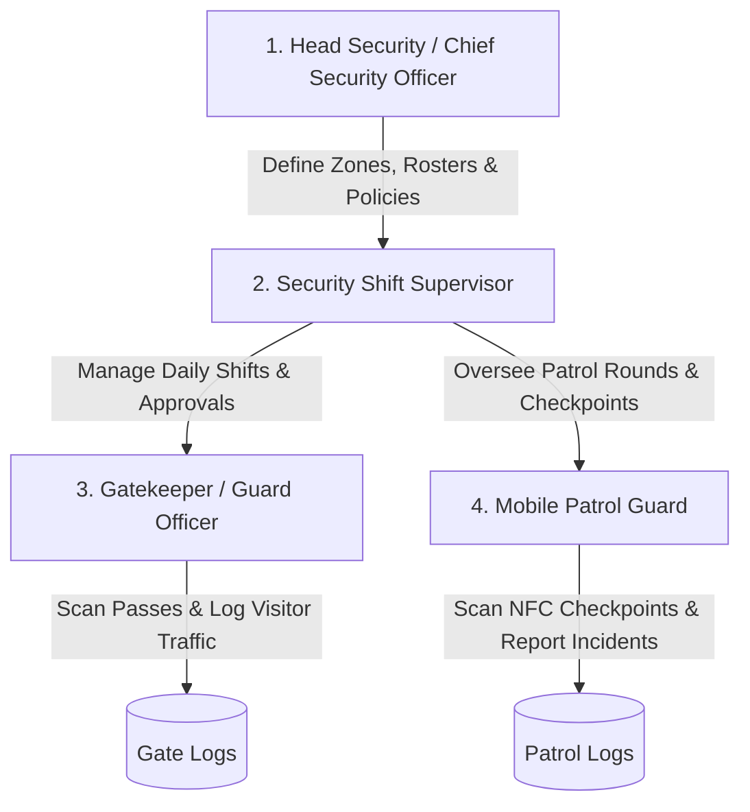
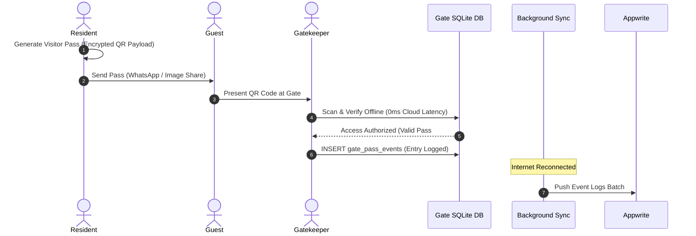
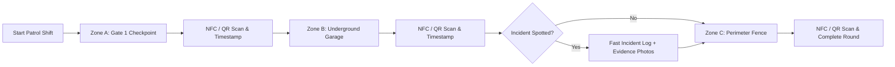

# RBC Security, Patrol Operations & Gatekeeping Architecture

This document details the **Role-Based Access Control (RBC) Security System**, **Offline-First Gatekeeper Portal**, **Mobile Guard Patrol**, and **Security Incident Engine** within WhatsUnity.

---

## 1. Security Hierarchy & Role Matrix

Security in WhatsUnity is organized into 4 distinct physical security roles:

| Security Role | Appwrite Sub-Role | Operational Focus |
| :--- | :--- | :--- |
| **Head Security** | `head_security` | Global compound security policies, post definitions, guard roster analytics, blacklist management, high-level incident escalation. |
| **Security Supervisor** | `supervisor` | Active shift monitoring, guard attendance verification, shift swap approvals (`shift_requests`), zone patrol route inspection. |
| **Gatekeeper** | `gatekeeper` | Perimeter access control: offline QR pass scanning, visitor license plate capture, frequent guest CRM lookup, resident apartment security alerts. |
| **Patrol Guard** | `patrol` | Perimeter inspections, NFC/QR physical checkpoint scans, Lost & Found cataloging with photo evidence and RTL watermarks, rapid incident logging. |

---

## 2. Gatekeeper Portal & 100% Offline Gate Access

### 2.1 Cryptographic Visitor QR Pass Workflow
1. **Pass Creation (Resident)**: The resident selects the visit type (`guest`, `delivery`, `contractor`), guest name, vehicle plate, valid time window, and single/multi-use constraints.
2. **Encrypted Payload Encoding**: The mobile client encodes an encrypted JSON payload into a QR code.
3. **Offline Scan & Instant Validation**:
   - The gatekeeper scans the QR code using the built-in scanner.
   - The local SQLite engine decrypts and verifies the pass validity instantly (under 5 milliseconds), checking timestamps and compound identity without requiring an internet connection.
   - The gatekeeper logs entry (`entered_at`) with vehicle details.
4. **Checkout Logging**: Upon guest exit, scanning the pass records `exited_at` and marks the pass as completed.

### 2.2 Frequent Guests Directory CRM & Blacklisting
- **Guests CRM (`guests_directory`)**: Maintains an indexed directory of frequent visitors, delivery couriers, and maintenance contractors.
- **Trust Levels**:
  - `trusted`: Fast-track pre-approved entry.
  - `neutral`: Standard ID verification.
  - `blacklisted`: Triggers an immediate crimson alarm popup on the gatekeeper's tablet, disabling pass entry and prompting security intervention.

### 2.3 Apartment Security Notes
Residents and security managers can attach temporary or permanent security notices to specific apartments (`resident_notes`):
- *"Do not allow delivery drivers past 10:00 PM."*
- *"Resident traveling abroad until Sept 15 — do not admit visitors without phone confirmation."*
- These notes automatically trigger an on-screen alert banner whenever a visitor arrives for that specific apartment number.

---

## 3. Mobile Guard Patrol & Physical Checkpoints

### 3.1 Physical NFC / QR Checkpoints
- Patrol guards navigate predefined compound zones (Clubhouse, Basements, Perimeter Walls, Playgrounds).
- Physical NFC tags or high-contrast QR codes affixed at checkpoints are scanned to prove guard physical presence at specified time intervals.

### 3.2 Lost & Found Cataloging
- Guards record found personal property, keys, and packages in the `lost_and_found` module.
- Integrated photo capture with RTL-compatible watermark overlays (`PatrolCinematicSurface`) prevents UI layout flipping on Arabic language devices.

### 3.3 Rapid Incident Evidence Logging
- Instant logging for parking violations, loud noise disturbances, perimeter breaches, or water leaks.
- Supports multi-photo evidence capture uploaded directly to Cloudflare R2 edge storage.
