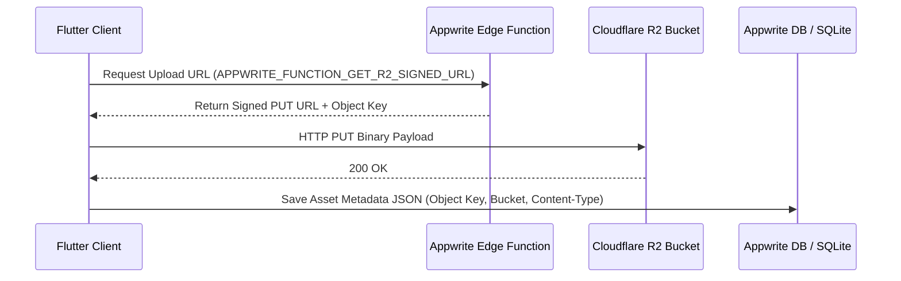

# Cloudflare R2 Storage Architecture

WhatsUnity utilizes **Cloudflare R2** as its single, unified object storage provider for all media types across the platform.

---

## 1. Unified Object Storage Overview

Previous versions of the app utilized third-party services (such as Gumlet) for streaming media. All asset types—including images, document attachments, AAC/M4A voice notes, and MP4 video recordings—are now consolidated into **Cloudflare R2**.



---

## 2. File Routing & Media Policy

File upload routing is managed in `lib/core/media/media_upload_service.dart` and `lib/core/media/media_route_policy.dart`.

- **Pre-signed Upload URLs**: The app invokes the Appwrite Edge Function `APPWRITE_FUNCTION_GET_R2_SIGNED_URL` to receive a temporary pre-signed HTTP PUT URL directly targetable against Cloudflare R2.
- **MIME & Container Mapping**:
  - **Images**: PNG, JPEG, WebP.
  - **Documents**: PDF, DOCX, TXT.
  - **Voice Notes**: Recorded in AAC/M4A format and uploaded directly to R2 with appropriate audio content headers (`audio/mp4` or `audio/aac`).
  - **Videos**: Compressed MP4 files uploaded to R2 and streamed via HTTP byte-range requests.

---

## 3. Metadata Storage Format

Media links are persisted in database fields (`uri`, `source_url`, `photo_url`, `id_photo_url`) as structured JSON metadata or direct Cloudflare R2 CDN public/signed GET URLs.

```json
{
  "provider": "cloudflare_r2",
  "key": "compounds/comp_123/chat/msg_8901.m4a",
  "url": "https://cdn.whatsunity.com/compounds/comp_123/chat/msg_8901.m4a",
  "content_type": "audio/m4a",
  "size_bytes": 145020
}
```
