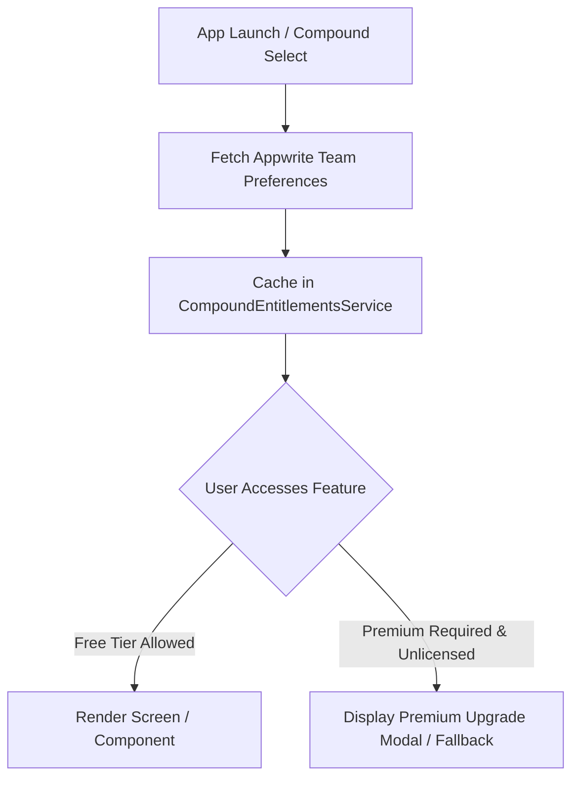

# Subscriptions, Plans & Compound Entitlements

WhatsUnity features a flexible multi-tier subscription engine designed to accommodate small residential buildings on budget-conscious zero-cost plans as well as luxury gated compounds requiring enterprise security and maintenance workflows.

---

## 1. Plan Tiering Matrix

| Feature / Capability | Free Plan (Community Tier) | Premium Plan (Enterprise Tier) |
| :--- | :---: | :---: |
| **Target Audience** | Small HOA communities, residential buildings, budget estates | Luxury gated compounds, large residential developments, towers |
| **Messaging Engine** | **Telegram MTProto Engine** | **Appwrite Realtime WebSockets Engine** |
| **Cloud Database Storage Cost** | **$0.00 / Month** (Zero Appwrite DB chat overhead) | Standard Appwrite storage & realtime plan |
| **Channel Scoping** | General Community Chat (via Telegram Channel) | General + Building-Specific Private Channels |
| **Resident Directory & Phonebook** | Yes (with Telegram direct links) | Full in-app CRM directory with verified badges |
| **Gatekeeper Access Control** | Basic Visitor Log | Full Offline Encrypted QR Gate Passes + Blacklist CRM |
| **Guard Patrol Operations** | No | NFC/QR Checkpoints, Incident Logging, Lost & Found |
| **Maintenance Workflows** | Basic Ticket Submission | 5-Tier Maintenance (Coordinator, Chief Eng, Supervisor, Tech) |
| **Emergency Broadcasts** | Yes (via Telegram Bot Broadcast) | In-App Push Alarms + Targeted Role Directives |
| **Building Financial Budgets** | No | Full Building Budget Tracking & Expense Management |
| **Cloud Object Storage** | Cloudflare R2 Standard | Cloudflare R2 Enterprise |

---

## 2. Dynamic Entitlement Enforcement

Plan entitlements are stored on the compound's Appwrite Team Preferences and resolved dynamically at runtime:

### 2.1 Backend Switching Logic
In `lib/core/di/app_services.dart`:
- When a compound operates under the **Free Tier**, `AppServices.useTelegramChatBackend()` binds the `TelegramChatRepositoryImpl`.
- When a compound upgrades to **Premium Tier**, `AppServices.useAppwriteChatBackend()` seamlessly switches to `ChatRepositoryImpl` with WebSockets support without requiring code modifications or app reinstallations.
