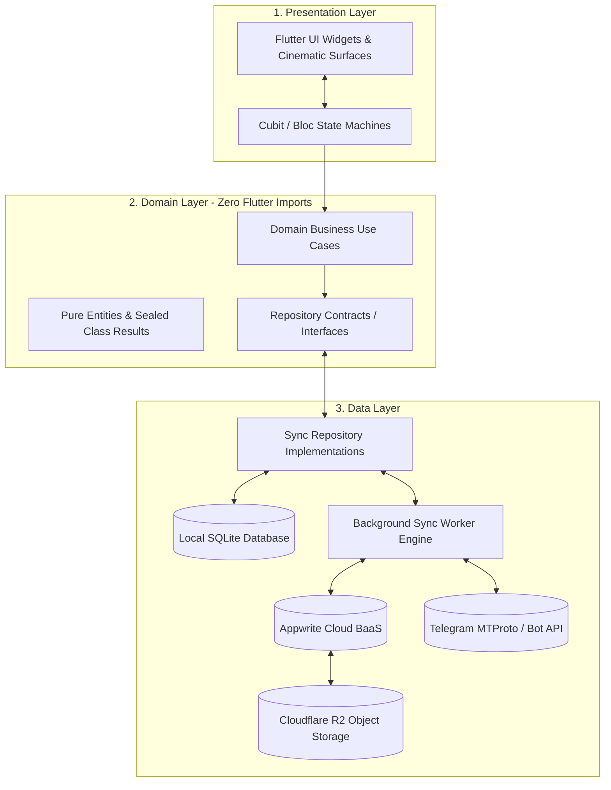
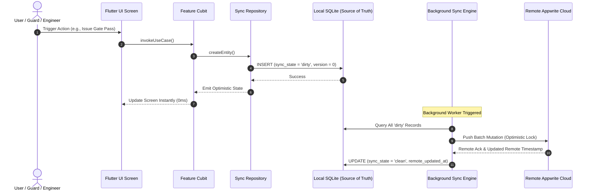
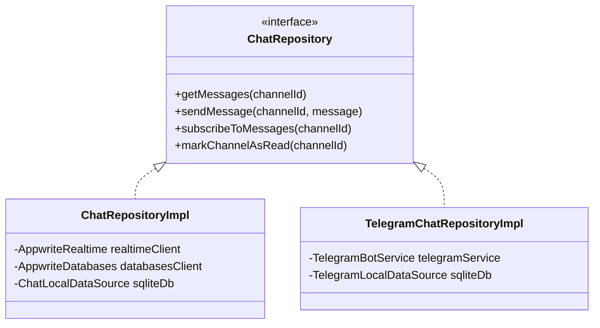

# WhatsUnity Technical Architecture & System Design

WhatsUnity is a production-grade, multi-tenant residential operating system engineered in Flutter and Dart 3. It utilizes an **Offline-First SQLite Master** architecture, a **Dual Messaging Engine** (Appwrite Realtime + Telegram API), an **Appwrite Multi-Database Cloud Backend**, and a **Cloudflare R2 Direct Edge Storage Pipeline**.

---

## 1. Core Architecture Principles & Layer Boundaries

The codebase strictly adheres to Clean Architecture principles with unidirectional data flow and zero code generation (`build_runner` or `freezed` are completely excluded in favor of Dart 3 sealed classes, switch expressions, and records).



---

## 2. Offline-First Master Sync Engine

### 2.1 The SQLite Local Master Model
In WhatsUnity, the client's local SQLite database is the primary source of truth:
- **Instant Mutation**: All user operations (creating gate passes, updating technician specializations, clocking in for shifts, filing maintenance tickets) write directly to local SQLite with `sync_state = 'dirty'`.
- **Instant UI Reaction**: UI widgets observe local SQLite tables via reactive streams or Cubits, responding in sub-milliseconds without network spinners.
- **Background Sync Engine**: A background worker scans for dirty entities, bundles changes, and executes optimistic concurrency mutations against Appwrite.



### 2.2 Conflict Resolution (LWW & Incremental Versioning)
Every synced domain entity implements `SyncMetadata`:
```dart
mixin SyncMetadata {
  int get version;
  SyncState get syncState; // clean, dirty, pendingDelete, failed
  DateTime? get localUpdatedAt;
  DateTime? get remoteUpdatedAt;
  DateTime? get deletedAt;
  String? get lastSyncError;
}
```
When conflicting changes occur on multiple devices, the Sync Engine applies **Last-Write-Wins (LWW)** with version increments, ensuring deterministic state across all nodes.

---

## 3. Dual-Engine Messaging Architecture

WhatsUnity decouples the chat interface from the underlying transport protocol via the `ChatRepository` contract:



1. **Appwrite Realtime Engine (`ChatRepositoryImpl`) — Premium Plan**:
   - Uses WebSockets over SSL directly to Appwrite Realtime.
   - Channel Scoping: General compound chat and building-specific private channels.
   - Read State Tracking: `channel_read_states` collection for unread badges.
2. **Telegram MTProto Engine (`TelegramChatRepositoryImpl`) — Free Plan**:
   - Zero-database-cost architecture routing messages through Telegram channels and bot webhooks.
   - Resident Telegram username linking (`@handle`) with in-app deep-linking.

---

## 4. Multi-Database Cloud Infrastructure (Appwrite)

WhatsUnity structures its cloud backend across **6 dedicated databases** to isolate concerns and enforce granular access policies:

| Database ID | Name | Core Collections & Responsibilities |
| :--- | :--- | :--- |
| **`auth`** | Identity & Tenancy | `profiles`, `user_roles`, `user_apartments`, `buildings`, `notification_preferences`, `compound_entitlements`. |
| **`social`** | Communication | `channels`, `messages`, `channel_read_states`, `posts`, `community_votes`, `comments`, `presence_sessions`, `announcements`. |
| **`admin`** | Governance | `user_reports`, `compound_governors`. |
| **`maintenance`** | Engineering Lifecycle | `maintenance_reports`, `report_code_counters`, `maintenance_attachments`, `maintenance_history`, `maintenance_team_members`, `work_orders`, `maintenance_member_attendance`, `compound_work_schedules`, `maintenance_compound_holidays`. |
| **`security`** | RBC Operations | `gate_passes`, `resident_notes`, `lost_and_found`, `security_shifts`, `security_team_members`, `security_incidents`, `gate_pass_events`, `guests_directory`, `guard_activities`, `compound_shift_settings`, `shift_requests`. |
| **`services`** | Commercial Services | `service_providers_roster`. |

---

## 5. Storage Pipeline: Cloudflare R2 Direct Edge

To achieve zero latency and reduce cloud bandwidth costs:
- **Cloudflare R2**: Used as the unified object store for photos, videos, audio voice notes, and PDF attachments.
- **Edge Signed URLs**: Appwrite Edge Functions generate secure, short-lived pre-signed PUT and GET URLs.
- **Direct Client Uploads**: Mobile clients upload binaries directly to Cloudflare R2 edge locations over HTTP/3, completely bypassing the backend server.

---

## 6. Dependency Injection & Service Locator (`AppServices`)

All services, data sources, repositories, and cubits are registered centrally in `lib/core/di/app_services.dart` using `GetIt`:

- `AppServices.init()` initializes local databases, network clients, and repository bindings.
- Runtime backend switching (`useTelegramChatBackend()` / `useAppwriteChatBackend()`) dynamically swaps repository bindings without requiring an application restart.
- Cubits resolve dependencies purely through constructor parameters or `AppServices` getters, ensuring 100% testability.
