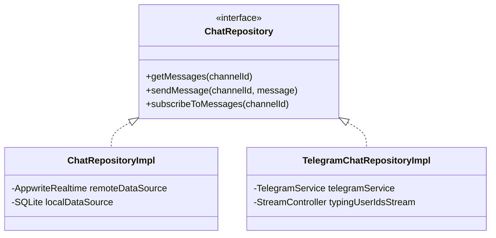

# Telegram Integration Architecture

WhatsUnity provides a dual-backend messaging architecture that allows gated communities to choose between a high-performance **Appwrite Realtime Engine** (Premium) and a zero-cost **Telegram Engine** (Free Plan).

---

## 1. Dual-Backend Architecture Design

The messaging system is decoupled from the UI via the `ChatRepository` abstract interface in `lib/features/chat/domain/repositories/chat_repository.dart`.



---

## 2. Implementation Details

### 2.1 `TelegramChatRepositoryImpl`
Located in `lib/features/chat/data/repositories/telegram_chat_repository_impl.dart`, this class adapts Telegram API calls and bot webhooks into the standard WhatsUnity message stream.

- **Typing Indicators**: `typingUserIdsStream` emits realtime typing events from Telegram chat participants directly into the Flutter `ChatBody` widget.
- **User Linking**: Users link their Telegram account by supplying their `telegram_username` in the Profile screen or during onboarding.
- **Login Flow**: Integrated `TelegramLoginScreen` handles Telegram widget/bot authentication (`whatsunity_telegram`).

### 2.2 Dynamic Backend Selection
In `lib/core/di/app_services.dart`:
```dart
static Future<void> useTelegramChatBackend() async {
  chatRepository = TelegramChatRepositoryImpl();
  final prefs = await SharedPreferences.getInstance();
  await prefs.setBool('use_telegram_chat_backend', true);
}

static Future<void> useAppwriteChatBackend() async {
  chatRepository = ChatRepositoryImpl(
    remoteDataSource: chatRemoteDataSource,
    localDataSource: chatLocalDataSource,
  );
  final prefs = await SharedPreferences.getInstance();
  await prefs.setBool('use_telegram_chat_backend', false);
}
```

---

## 3. Directory & Contact Integration

Telegram handle shortcuts are integrated directly across user interface components:
- **Profile Screen**: Edit and verify `telegramUsername`.
- **Phonebook & Directory**: Tap the Telegram icon on neighbor or staff contact cards (`premium_contact_card.dart`) to open direct Telegram chats via deep links (`https://t.me/<username>`).
- **Add Contact Dialog**: Input optional `telegramUsernameOptional` when saving compound contacts.

---

## 4. Free Plan Synergy

Communities on the **Free Plan** utilize Telegram to avoid cloud database operations costs for general chat. Resident messages, announcements, and maintenance alerts pass through Telegram, while local SQLite caches recent messages on-device for offline reading.
