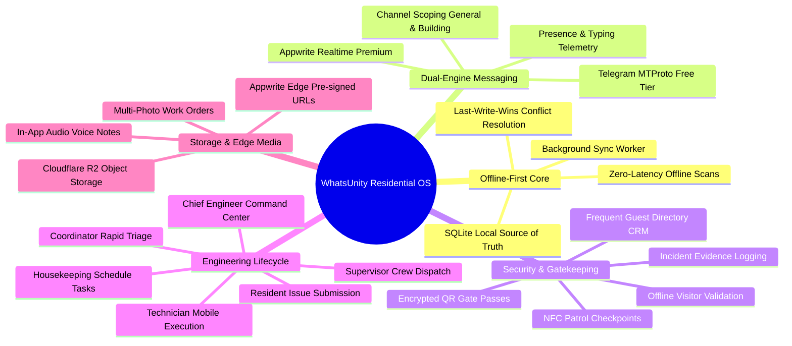
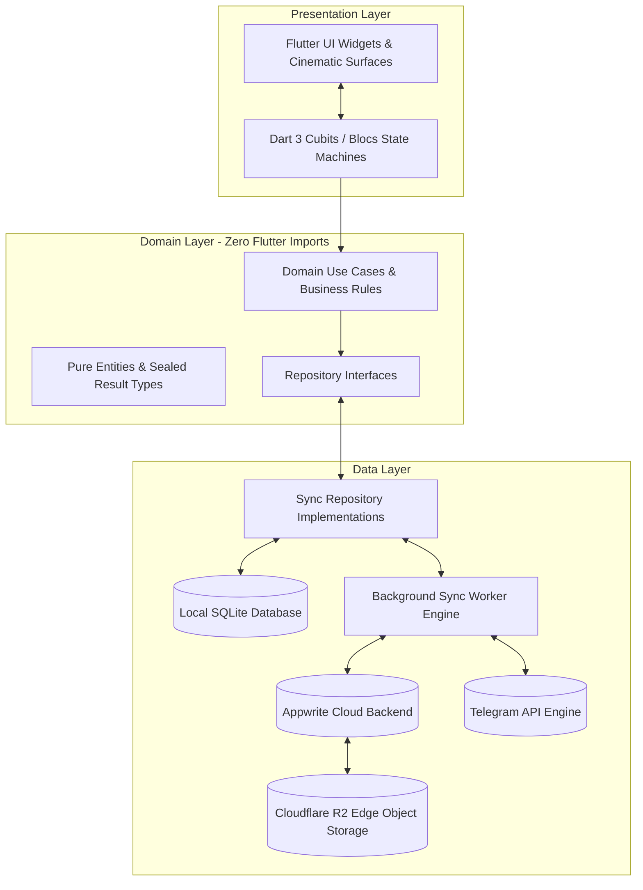
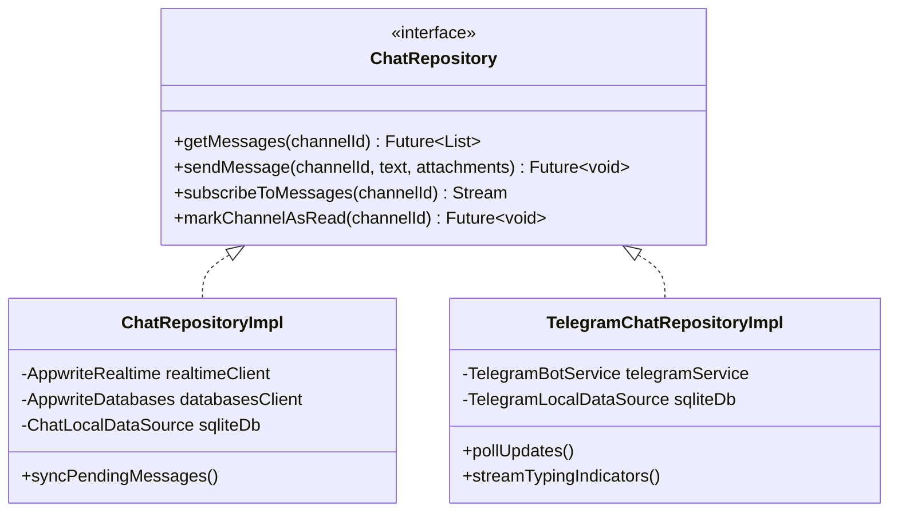
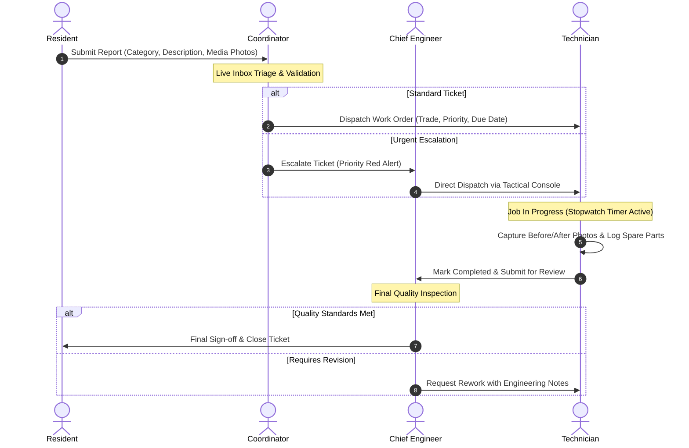
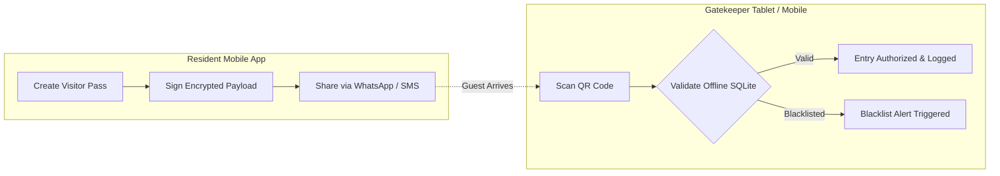

# Case Study: WhatsUnity — Engineering an Offline-First, Multi-Tenant Residential Operating System

> **Executive Overview**  
> WhatsUnity is a modern, enterprise-grade, offline-first residential operating system and community platform engineered in Flutter and Dart 3. It unifies gated community administration, dual-engine social communication (Appwrite Realtime & Telegram API), 100% offline gate access control, multi-tiered security patrol operations, and an end-to-end 5-role engineering maintenance lifecycle into a single, high-performance cross-platform application.

---

## 1. Executive Summary & Problem Statement

### 1.1 The Fragmented Reality of Modern Residential Communities
Modern gated compounds, residential towers, and residential estates face a critical operational breakdown:
1. **The "WhatsApp Group" Chaos**: Community communication is fragmented across unmoderated instant messaging groups, leading to spam, privacy leaks, lost announcements, and zero administrative oversight.
2. **Infrastructure Fragility & Offline Vulnerability**: Guard booths, underground parking garages, perimeter fences, and basement utility rooms frequently suffer from 4G/Wi-Fi dead zones. Traditional cloud-dependent apps fail instantly when offline, locking visitors out at the gate and halting maintenance.
3. **Prohibitive SaaS Costs**: Existing property management platforms charge steep per-door monthly subscriptions, making enterprise-grade software inaccessible for small-to-medium compounds and budget-conscious HOAs (Homeowners Associations).
4. **Disconnected Operations**: Security guards use paper visitor logs; maintenance tickets are lost in phone calls; technicians lack job accountability; and chief engineers have zero telemetry over ongoing repairs, work orders, and spare parts.

### 1.2 The WhatsUnity Mission
WhatsUnity was engineered from the ground up to solve these structural problems by delivering:
- **Zero-Connectivity Resilience**: An offline-first local SQLite master architecture that guarantees instant sub-millisecond UI responses and uninterrupted gate/patrol/maintenance operations during complete internet blackouts.
- **Dual-Engine Cost Disruption**: A pluggable messaging architecture offering a zero-cost **Telegram Engine** for free-tier communities and a low-latency **Appwrite Realtime Engine** for premium compounds.
- **End-to-End Operational Unity**: A cohesive 9-role permission model connecting Residents, Gatekeepers, Patrol Guards, Head Security, Coordinators, Technicians, Supervisors, Chief Engineers, and Compound Managers in a unified real-time workflow.
- **Cinematic RTL-First Design**: A bespoke, bilingual (Arabic/English) design system with glassmorphic depth, dynamic micro-animations, and haptic feedback tailored for both enterprise staff and everyday residents.



---

## 2. System Architecture & Core Engineering Innovations

WhatsUnity adheres strictly to Clean Architecture principles, enforcing unidirectional data flow across Presentation, Domain, and Data layers without relying on third-party code generation (`build_runner` or `freezed`).



---

### 2.1 The Offline-First Sync Engine & Entity Versioning
Unlike conventional apps that treat remote APIs as the immediate source of truth, WhatsUnity treats the local SQLite database on the device as the primary source of truth:
1. **Immediate Local Mutation**: When a user creates a gate pass, updates a technician's trade, or submits a work order, the record is immediately written to SQLite with `sync_state = 'dirty'` and a local timestamp. The UI updates instantaneously (0ms latency).
2. **Background Sync Worker**: A dedicated synchronization worker periodically scans for dirty records, batches them, and pushes them to Appwrite databases via optimistic concurrency control.
3. **Deterministic Conflict Resolution (LWW)**: Every entity incorporates the `SyncMetadata` contract with an incremental integer `version` field and timestamps (`local_updated_at`, `remote_updated_at`). In the event of concurrent multi-device updates, Last-Write-Wins (LWW) with version incrementing resolves collisions deterministically.

```dart
/// Core synchronization contract applied across all domain entities
mixin SyncMetadata {
  int get version;
  SyncState get syncState; // clean, dirty, pendingDelete, failed
  DateTime? get localUpdatedAt;
  DateTime? get remoteUpdatedAt;
  DateTime? get deletedAt;
  String? get lastSyncError;
}
```

---

### 2.2 Dual-Engine Messaging Architecture (Appwrite vs. Telegram)
To eliminate infrastructure costs for budget-constrained communities while providing enterprise real-time capabilities for premium compounds, WhatsUnity developed a pluggable, polymorphic chat backend:



- **Appwrite Realtime Engine (Premium Tier)**: Connects to Appwrite Realtime WebSockets scoped to the compound's active channel (`messages`, `channel_read_states`). Supports sub-second delivery, native presence tracking, read receipts, and encrypted media streaming.
- **Telegram Engine (Free Tier)**: Routes community announcements and group messages through Telegram Bot and MTProto APIs. Stores user Telegram usernames (`@handle`) and eliminates cloud database storage and bandwidth costs entirely.

---

### 2.3 Cloudflare R2 Direct Edge Storage Pipeline
WhatsUnity replaces slow, expensive backend media proxying with a direct Cloudflare R2 edge pipeline:
1. When a resident or technician attaches photos/audio to a ticket, the app requests a cryptographically signed PUT URL from an Appwrite Edge Function (`APPWRITE_FUNCTION_GET_R2_SIGNED_URL`).
2. The client uploads the binary directly to Cloudflare R2 over HTTP/3, bypassing backend CPU and memory bottlenecks.
3. Media retrieval uses signed, cached CDN URLs with global edge distribution.

---

## 3. The 9-Role Persona Matrix & Operational Workflows

WhatsUnity provides dedicated, highly specialized interfaces for every tier of residential community governance:

| Role | Primary Responsibility | Key Features & Modules |
| :--- | :--- | :--- |
| **Resident / Owner** | Daily residential living, access & service requests | Digital QR guest passes, maintenance ticket filing with media attachments, building & general chat, official community polls, phonebook directory, emergency alerts. |
| **Gatekeeper / Guard** | Perimeter security & visitor authentication | 100% offline QR gate pass scanner, guest CRM directory, license plate logging, resident apartment security notes, blacklisting alerts, fast incident filing. |
| **Head Security / Supervisor** | Shift management & physical security oversight | Guard shift rostering, post assignments, live patrol route tracking, shift swap request approvals, incident review & escalation, security metric analytics. |
| **Patrol Guard** | Mobile perimeter inspection & asset safety | Interactive zone check-ins, NFC/QR patrol checkpoints, Lost & Found cataloging with RTL watermarks, on-the-fly incident evidence logging. |
| **Maintenance Coordinator** | Ticket triage & operational dispatch | Centralized maintenance inbox, category visual classification, report code generation, technician dispatch console, urgency prioritization. |
| **Chief Engineer** | Engineering oversight, team capacity & sign-offs | Single-row KPI telemetry, priority escalations hub, live coordinator operator monitoring, technicians roster workload balancing, weekly workdays & holiday calendar, final quality approvals. |
| **Maintenance Supervisor** | Field team leadership & resource management | Active shift rosters, technician trade specializations, spare parts requisitions review & approvals, housekeeping recurring task schedules. |
| **Technician (Trade Specialist)** | Physical repair execution & field reporting | Work orders queue, active job stopwatch timer, before/after repair photo capture, spare parts request workflow, technician completion notes. |
| **Housekeeping Crew** | Daily sanitation & recurring facility upkeep | Facility zone checklists, recurring scheduled maintenance tasks, completion photo verification. |
| **Compound Manager / Admin** | Macro governance, billing & community broadcast | Resident verification & KYC approvals, building financial budgets, compound-wide broadcast announcement publisher with role targeting. |

---

## 4. Deep Dive: The Multi-Tiered Engineering Lifecycle

The maintenance subsystem in WhatsUnity represents an enterprise-grade state machine designed to eliminate lost tickets, enforce technician accountability, and ensure quality sign-off:



### 4.1 Coordinator Dispatch & Triage Inbox
- **Instant Categorization**: Automatic visual classification across 9 trades (Plumbing, Electrical, HVAC, Carpentry, Painting, Structural, Gardening, Pest Control, Housekeeping).
- **Automated Report Numbering**: Sequential report counters (`#MNT-1042`) generated per compound.
- **Direct Dispatch**: One-tap assignment to active on-duty technicians based on real-time trade match.

### 4.2 Chief Engineer Executive Command Hub
- **Single-Row KPI Telemetry Ribbon**: Real-time active tickets and high-priority escalation counts.
- **Coordinator Operator Status Monitor**: Live verification showing if the operational coordinator is clocked in and actively managing incoming tickets. If the coordinator is offline, the Chief Engineer is alerted to take over direct triage.
- **Tactical Field Dispatch Console**: Integrated multi-trade technician selector with live workload meters (`0-2 Tasks: Available` [Green], `3-5 Tasks: Optimal` [Blue], `6+ Tasks: High Load` [Red]).
- **Unified Operations Command (Teams & Approvals)**: Triple-segment switcher providing:
  1. *Approvals Tab*: Review completed work orders, inspect technician notes and spare parts, and issue final approvals or request rework.
  2. *Technicians Tab*: Live directory with search, trade filter chips, and dynamic specialization reassignment.
  3. *Schedules Tab*: Toggle compound weekly workdays and interactive monthly holiday calendar with tap-to-toggle off-days.

---

## 5. Deep Dive: RBC Security & 100% Offline Gatekeeping



### 5.1 Encrypted QR Pass Architecture
- **Cryptographic Payload**: Each gate pass contains an encrypted JSON payload with unique pass ID, resident user ID, compound ID, vehicle plate, expiration date, and single/multi-use constraints.
- **Zero-Latency Offline Validation**: When scanned at the gate, the gatekeeper's device decodes and validates the pass against the local SQLite cache without requiring a live cloud handshake.
- **Entry / Exit Telemetry**: Entry (`entered_at`) and exit (`exited_at`) timestamps are written to SQLite and synced in the background when connectivity resumes.

### 5.2 Guest CRM Directory & Resident Security Notes
- **Frequent Guests Directory**: Tracks regular contractors, deliveries, and trusted guests with photo ID verification and trust levels (`trusted`, `neutral`, `blacklisted`).
- **Apartment Security Notes**: Instructions filed by residents (e.g., *"No deliveries permitted after 10 PM"*, *"Owner traveling abroad"*) pop up automatically on the gatekeeper's screen upon scanning any pass linked to that unit.

---

## 6. UI/UX Excellence & Impeccable Design Craft

WhatsUnity is built using an artisanal, cinematic design system that rejects cookie-cutter UI templates:

```
┌─────────────────────────────────────────────────────────────┐
│  PATROL CINEMATIC SURFACE                                   │
│  ┌───────────────────────────────────────────────────────┐  │
│  │  [Category Icon Pod]   HVAC Maintenance    [BEACON]   │  │
│  │  #MNT-1082 · Building 4, Apt 201           ACTIVE     │  │
│  │                                                       │  │
│  │  Compressor overheating and tripping circuit breaker  │  │
│  │                                                       │  │
│  │  ┌──────────────┐  ┌──────────────┐                   │  │
│  │  │ 📍 Bldg 4    │  │ ⏱ 10:45 AM   │   [TACTICAL ROUTE]│  │
│  │  └──────────────┘  └──────────────┘                   │  │
│  └───────────────────────────────────────────────────────┘  │
│                          [WATERMARK ICON - RTL COMPATIBLE]  │
└─────────────────────────────────────────────────────────────┘
```

1. **RTL-First Arabic & English Bi-Directionality**: Every layout, icon rotation, badge placement, and watermark respects Arabic RTL typography (`Tajawal` / `Inter`) and alignment without flipped or clipped elements.
2. **Glassmorphism & Depth**: Surfaces utilize multi-layered HSL color tokens, subtle mesh glow borders (`Border.all(color: accent.withValues(alpha: 0.2))`), and soft elevation shadows.
3. **Tactile Haptic Feedback**: Every critical interaction—clocking in for a shift, toggling holiday calendar days, approving work orders, and scanning gate passes—triggers light or medium haptic vibrations.
4. **State Machine Guards**: All screens handle null, loading, empty, and offline error states cleanly with custom illustrated `CinematicEmptyState` and `CinematicOfflineState` widgets with retry callbacks.

---

## 7. Technology Stack Summary

| Layer | Technology | Purpose & Implementation |
| :--- | :--- | :--- |
| **Framework** | **Flutter 3.x / Dart 3.x** | Cross-platform mobile (iOS & Android) and web client. |
| **Architecture** | **Clean Architecture** | Strict separation: Presentation → Domain → Data. |
| **State Management** | **Cubit / Bloc** | Predictable, reactive state machines with zero code-generation. |
| **Dependency Injection** | **GetIt (`AppServices`)** | Centralized, decoupled service locator and repository registry. |
| **Local Persistence** | **SQLite (`sqflite`)** | Offline-first relational cache and local source of truth. |
| **Cloud Backend** | **Appwrite Cloud** | Multi-database BaaS (Auth, Social, Security, Maintenance, Services). |
| **Realtime WebSockets** | **Appwrite Realtime** | Sub-second push telemetry for chat, approvals, and badge counters. |
| **Messaging Engine (Free)** | **Telegram MTProto / Bot API** | Zero-cost messaging bridge for budget-conscious communities. |
| **Object Storage** | **Cloudflare R2** | High-speed, S3-compatible edge storage with pre-signed URLs. |
| **Typography & Styling** | **Google Fonts (Tajawal, Inter)** | Bespoke cinematic typography with full Arabic RTL support. |

---

## 8. Business Impact, Scalability & Case Study Takeaways

### 8.1 Key Measurable Outcomes
- **100% Offline Continuity**: Zero security gate delays or lost work orders during network outages.
- **Up to 80% Reduction in Infrastructure Costs**: Free-tier communities operate at near-zero cloud database cost by leveraging Telegram for messaging and SQLite for local caching.
- **Sub-10ms UI Perception**: Local SQLite master writes ensure instant UI feedback with zero network spinning indicators for routine operations.
- **Elimination of WhatsApp Sprawl**: Official announcements, building-scoped chats, maintenance tickets, and security logs are organized into verified, auditable channels.

### 8.2 Strategic Vision & Extensibility
WhatsUnity proves that enterprise-grade community governance software does not require expensive per-user cloud licenses or fragile online-only architectures. By pairing Flutter's UI performance with a strict offline-first sync engine and a dual-engine messaging backend, WhatsUnity sets a new benchmark for smart residential operating systems.
